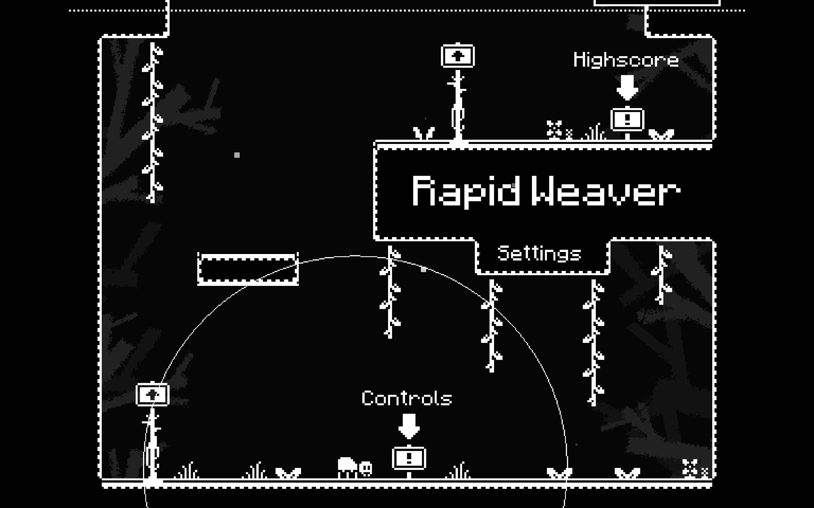
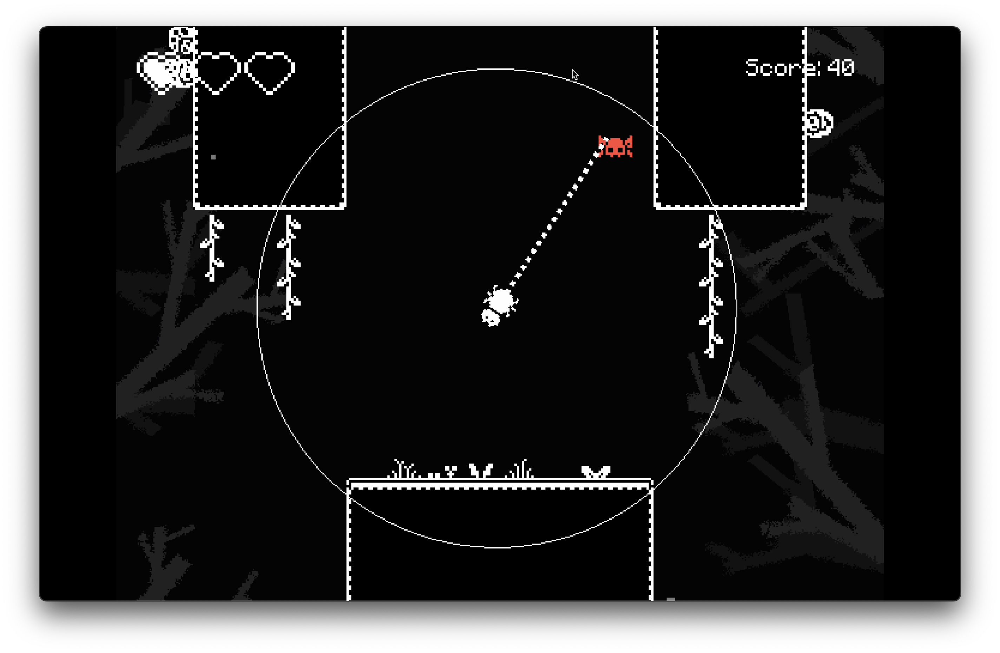
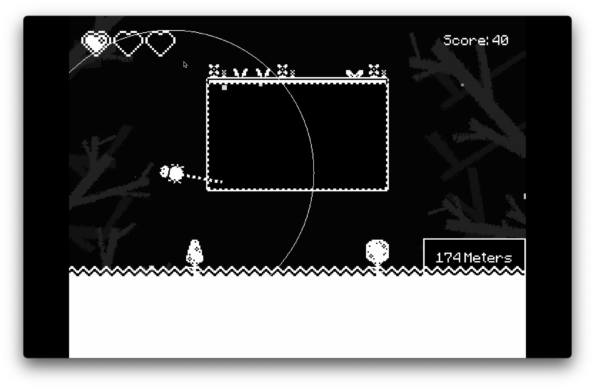

# Rapid Weaver

## Table of Contents
- [Links](#links)
- [Overview](#overview)
- [Author's Notes](#authors-notes)
- [Features](#features)
- [Built with](#built-with)
- [Next Steps](#next-steps)

## Links
- [Itch.io](https://josephmck.itch.io/rapid-weaver)
- [Personal Website](https://lgirotto.dev)
- [LinkedIn](https://www.linkedin.com/in/lucas-girotto-4530b9233/)

## Overview
Rapid Weaver is a vertical endless runner on which you control a little spooder and swing through the environment while avoiding those nasty forest bugs.

## Screenshots

    
    
    

## Author's Notes
This was the first game idea that I wanted to take and build a fully fledged-out game, and it took me about 8 months to do so. It was a hell of a ride, and i'm just flabbergasted at how much my game making skills have improved.

Rapid Weaver was born out of a simple idea of wanting to make a grappling hook game. I had to do a bit of ideation and brainstorming to come up with a reason to have a grappling hook, while maintaining a small scope for a game.

What took me the longest was the first couple of months in which I had bug after bug when dealing with grappling hook mechanics and the wall crawlling. Since the sprite isn't a square, I needed to do some hacking to get the player to stick to the walls and not fall off, as I was rotating the player to face the direction of the wall, and setting gravity to work in that direction as well.

It's always awesome to finish projects like these, and the boost of motivation when the game is finally released is unparalleled.

## Features
- Grappling hook mechanics
- Wall crawling
- Random Level Layout
- Endless Runner
- High Score System
- Multiple enemy types

## Built with

- [Godot](https://godotengine.org/)
- [Aseprite](https://www.aseprite.org/)

## Next Steps
I'm putting this game on the shelf for now. I'm going to be working on a new project, with my brother, and I'm really excited for how our ideas have been shaping.
